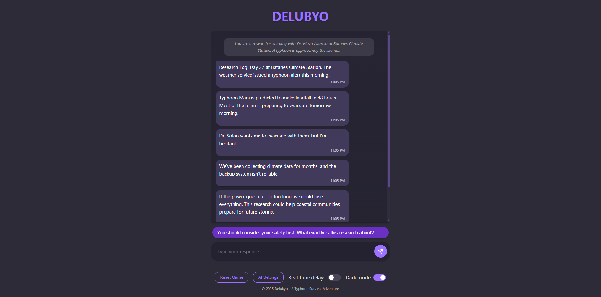

# Delubyo



An interactive text adventure game set in the Philippines during a typhoon disaster. Inspired by games like Lifeline (3 Minute Games, Inc.) and Firewatch, Delubyo creates an immersive storytelling experience where your choices shape the narrative.

## Installation

### Prerequisites

Make sure you have Node.js installed on your system. Then, install Yarn globally:

```bash
npm install -g yarn
```

### Setup

1. Clone the repository:
   ```bash
   git clone https://github.com/komiwalnut/Delubyo.git
   cd Delubyo
   ```

2. Install dependencies:
   ```bash
   yarn install
   ```

## Development

To start the development server:

```bash
yarn dev
```

This will launch the application at `http://localhost:3000`.

## Scripts

- `yarn dev` - Start the development server
- `yarn build` - Build the application for production
- `yarn preview` - Preview the production build locally
- `yarn lint` - Run ESLint to check for code issues

## Alternative Package Managers

You can also use pnpm if preferred:

```bash
# Install pnpm if you don't have it
npm install -g pnpm

# Install dependencies
pnpm install

# Start development server
pnpm dev

# Run linting
pnpm lint
```

## AI Integration

Delubyo supports different AI providers for enhancing game content:

- OpenAI (ChatGPT)
- Claude AI
- DeepSeek AI
- Google Gemini

You can configure these providers in the game settings.

## License

This project is licensed under the MIT License - see the LICENSE file for details.